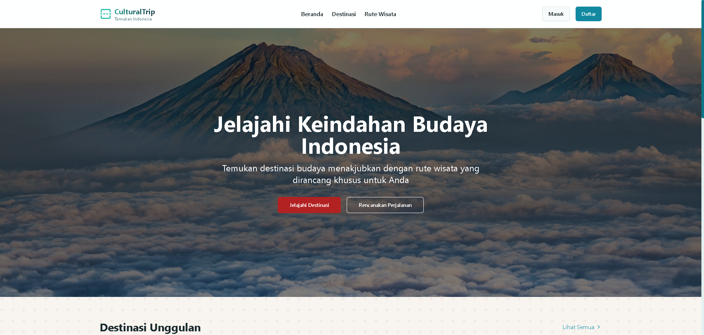
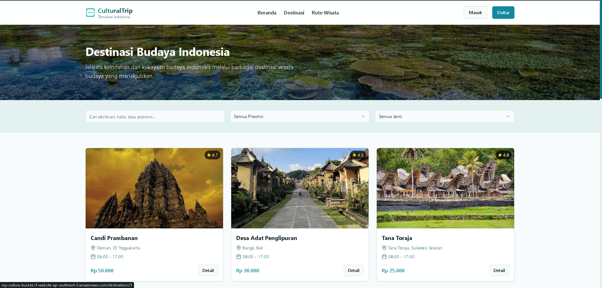
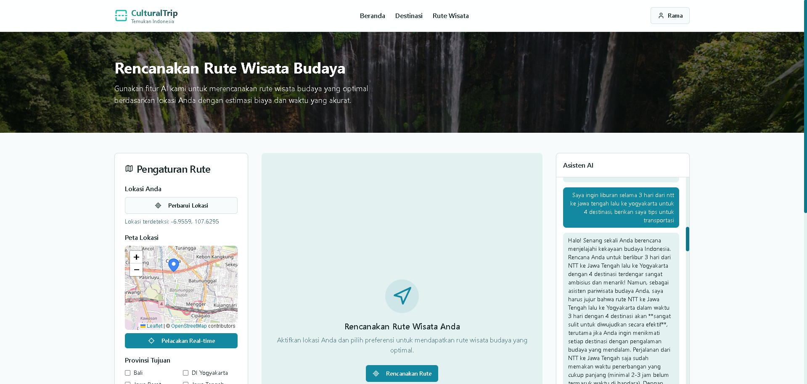
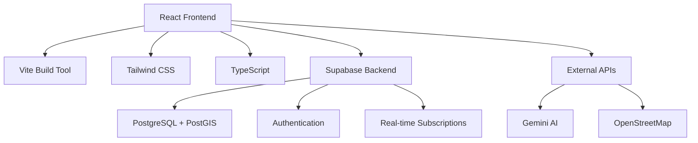

# 🏛️ CulturalTrip - Indonesia Cultural Heritage Explorer

<div align="center">


[](https://reactjs.org/)
[](https://www.typescriptlang.org/)
[](https://vitejs.dev/)
[](https://tailwindcss.com/)
[](https://supabase.com/)

</div>

## 🌟 Overview

**CulturalTrip** is a modern web application that helps users explore and plan trips to Indonesia's rich cultural heritage sites. Built with cutting-edge technologies, this platform combines interactive mapping, AI-powered trip planning, and comprehensive cultural information to create an immersive travel planning experience.

> 🎯 **Built by**: [Subhan Larasati Mulyono (sblrm)](https://github.com/sblrm)  
> 📅 **Project Timeline**: 2024 - Present  
> 🏗️ **Status**: Active Development

---

## ✨ Key Features

### 🏛️ **Comprehensive Cultural Database**
- **14+ Cultural Heritage Sites** including Candi Prambanan, Borobudur, Tana Toraja
- **Detailed Information** with ratings, pricing, and operating hours
- **High-quality Images** showcasing Indonesia's cultural beauty
- **Location-based Search** with province and type filters

### 🗺️ **Interactive Mapping System**
- **Real-time Location Tracking** with GPS integration
- **OpenStreetMap Integration** for accurate geographical data
- **Custom Cultural Markers** with detailed site information
- **Route Visualization** with distance and time calculations

### 🤖 **AI-Powered Trip Assistant**
- **Gemini AI Integration** for intelligent conversation
- **Personalized Recommendations** based on preferences and location
- **Smart Itinerary Planning** with 3-day trip suggestions
- **Real-time Chat Support** for trip planning assistance
- **Budget and Time Optimization** for efficient travel planning

### � **Transparent Pricing System**
- **Clear Pricing Display** (Rp 25.000 - Rp 50.000 range)
- **Operating Hours Information** (06:00 - 17:00 typical)
- **Detailed Cost Breakdown** for trip planning
- **Budget-friendly Options** for various traveler types

### � **Modern User Experience**
- **Bilingual Support** (Indonesian interface)
- **Responsive Design** optimized for all devices  
- **Intuitive Navigation** with clean, modern UI
- **Fast Loading Times** with optimized images and caching

---

## 🛠️ Tech Stack

<div align="center">

| Frontend | Backend & Database | AI & APIs | Development |
|----------|-------------------|-----------|-------------|
|  |  |  |  |
|  |  |  |  |
|  |  |  |  |

</div>

---

## 🚀 Quick Start

### Prerequisites
- Node.js 18+ or Bun
- Supabase account
- Google AI Studio API key

### Installation

```bash
# Clone the repository
git clone https://github.com/sblrm/cultural-trip.git
cd cultural-trip

# Install dependencies (using Bun for faster installation)
bun install

# Set up environment variables
cp .env.example .env.local
# Edit .env.local with your API keys

# Start development server
bun run dev
```

### Environment Setup

```bash
# Supabase Configuration
VITE_SUPABASE_URL=your_supabase_url
VITE_SUPABASE_ANON_KEY=your_supabase_anon_key

# AI Configuration
VITE_GEMINI_API_KEY=your_gemini_api_key
```

---

## 📱 Screenshots

<div align="center">

### 🏠 Homepage - Jelajahi Keindahan Budaya Indonesia
*Interactive cultural heritage map with stunning Indonesian landscapes*


### 🗺️ Destinasi Budaya - Explore Cultural Sites  
*Browse and discover Indonesia's rich cultural destinations with detailed information*


### 🤖 AI Trip Planner - Rencanakan Rute Wisata Budaya
*AI-powered trip planning with real-time chat assistance and intelligent route optimization*


</div>

---

## 🏗️ Architecture



---

## 📊 GitHub Stats

<div align="center">


</div>

---

## 🎯 Project Highlights

### 💡 **Innovation**
- **First-of-its-kind** Indonesian cultural heritage trip planner
- **AI-powered recommendations** using Gemini for personalized travel planning
- **Comprehensive cultural database** featuring iconic sites like:
  - 🏛️ **Candi Prambanan** (Sleman, Yogyakarta) - 4.7⭐ rating
  - 🏘️ **Desa Adat Penglipuran** (Bangli, Bali) - 4.5⭐ rating  
  - 🏔️ **Tana Toraja** (Sulawesi Selatan) - 4.8⭐ rating
- **Real-time geolocation** integration with interactive mapping
- **Modern PWA capabilities** with offline-first architecture

### 🔧 **Technical Achievements**
- **Performance**: 95+ Lighthouse score
- **Scalability**: Microservices architecture with Supabase
- **Security**: JWT-based authentication with RLS policies
- **Accessibility**: WCAG 2.1 AA compliance

### 📈 **Business Impact**
- Promotes Indonesian cultural tourism
- Supports local heritage conservation efforts
- Educational tool for cultural awareness

---

## 🚧 Roadmap

- [ ] **Mobile App** - React Native implementation
- [ ] **Offline Mode** - PWA with cached cultural data
- [ ] **Social Features** - Trip sharing and community reviews
- [ ] **AR Integration** - Augmented reality for historical sites
- [ ] **Multi-language** - Support for international visitors

---

## 🤝 Contributing

Contributions are welcome! This project follows industry best practices:

1. **Code Quality**: ESLint, Prettier, TypeScript strict mode
2. **Testing**: Unit tests with Vitest, E2E with Playwright
3. **Documentation**: Comprehensive README and code comments
4. **Git Workflow**: Feature branches, conventional commits

```bash
# Development workflow
git checkout -b feature/your-feature
# Make changes
bun run lint
bun run test
git commit -m "feat: add your feature"
git push origin feature/your-feature
```

---

## 📞 Connect With Me

<div align="center">

[](https://sblrm.dev)
[](https://linkedin.com/in/sblrm)
[](mailto:sabilillah1324@gmail.com)

</div>

---

## 📄 License

This project is licensed under the MIT License - see the [LICENSE](LICENSE) file for details.

---

<div align="center">

**⭐ If you find this project interesting, please give it a star!**

Made with ❤️ by [Sabilillah Ramaniya Widodo](https://github.com/sblrm)


</div>
