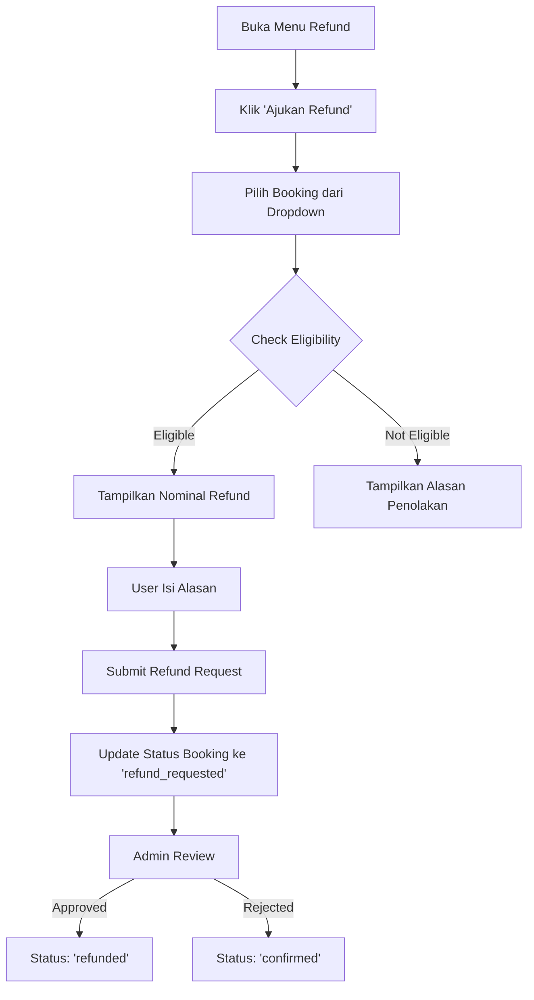

# Booking & Refund System Documentation

## Overview
Sistem pemesanan dan refund yang telah diperbaiki untuk TravoMate, dengan pemisahan yang jelas antara booking aktif, riwayat transaksi, dan permintaan refund.

**Date:** October 31, 2025  
**Version:** 2.0

---

## System Architecture

### 1. My Booking (Pemesanan Saya)
**Purpose:** Menampilkan tiket yang **aktif** dan **belum digunakan**

**Status yang ditampilkan:**
- `pending_payment` - Menunggu Pembayaran
- `paid` - Sudah Dibayar
- `confirmed` - Dikonfirmasi
- `refund_requested` - Sedang Diajukan Refund

**Features:**
- ✅ Detail destinasi lengkap (nama, lokasi, foto)
- ✅ Tanggal dan waktu kunjungan
- ✅ Jumlah tiket/peserta
- ✅ Status badge dengan warna berbeda
- ✅ Booking code (format: TRV-YYYYMMDD-XXXX)
- ✅ Tombol "Lihat Detail"
- ✅ Tombol "Ubah Jadwal" (reschedule)
- ✅ Tombol "Batalkan" dengan refund otomatis jika memenuhi syarat

**Query Logic:**
```typescript
// Hanya ambil booking dengan status aktif
.in('status', ['pending_payment', 'paid', 'confirmed'])
.order('visit_date', { ascending: true }) // Urutkan berdasarkan tanggal kunjungan terdekat
```

---

### 2. Purchase List (Daftar Pembelian)
**Purpose:** Menampilkan **riwayat transaksi** yang sudah selesai

**Status yang ditampilkan:**
- `used` - Sudah Digunakan/Selesai
- `refunded` - Dana Dikembalikan
- `cancelled` - Dibatalkan

**Features:**
- ✅ Nomor transaksi (order_id)
- ✅ Destinasi yang dibeli
- ✅ Tanggal pembelian
- ✅ Tanggal kunjungan
- ✅ Harga total
- ✅ Metode pembayaran
- ✅ Status badge
- ✅ Tombol "Beli Lagi"
- ✅ Tombol "Unduh Invoice" (PDF - coming soon)

**Query Logic:**
```typescript
// Hanya ambil booking yang sudah selesai
.in('status', ['used', 'refunded', 'cancelled'])
.order('created_at', { ascending: false }) // Urutkan dari yang terbaru
```

---

### 3. Refund System
**Purpose:** Mengelola permintaan pengembalian dana

#### 3.1 Eligibility Check (Kelayakan Refund)

**Automatic validation:**
1. ✅ Status booking harus `paid` atau `confirmed`
2. ✅ Tanggal kunjungan belum lewat
3. ✅ Belum ada permintaan refund sebelumnya

**Refund Percentage Based on Timing:**
- **≥ 7 hari sebelum kunjungan:** 100% refund
- **3-7 hari sebelum kunjungan:** 50% refund
- **< 3 hari sebelum kunjungan:** 25% refund

**Database Function:**
```sql
check_refund_eligibility(booking_id_param BIGINT)
-- Returns JSON with:
-- - eligible: boolean
-- - message: string
-- - refund_percentage: number
-- - refund_amount: number
-- - days_until_visit: number
-- - original_amount: number
```

#### 3.2 Request Refund Flow

**User Journey:**


**Database Function:**
```sql
request_refund(
  user_id_param UUID,
  booking_id_param BIGINT,
  reason_param TEXT
)
-- Returns JSON with:
-- - success: boolean
-- - message: string
-- - refund_id: bigint
-- - refund_amount: number
-- - refund_percentage: number
```

#### 3.3 Refund Status

**Status Flow:**
```
pending → approved → completed
        ↘ rejected
```

- **pending**: Permintaan baru diajukan, menunggu review admin
- **approved**: Admin menyetujui, proses pengembalian dana dimulai
- **rejected**: Admin menolak dengan alasan tertentu
- **completed**: Dana sudah dikembalikan ke user
- **cancelled**: User membatalkan permintaan sendiri

---

## Database Schema Changes

### New Migration: `enhance_refunds_system.sql`

**Key Changes:**

1. **refunds table additions:**
   ```sql
   booking_id BIGINT           -- Link to bookings (preferred over ticket_id)
   refund_amount NUMERIC(10,2) -- Calculated refund amount
   approved_by UUID            -- Admin who processed the refund
   refund_method VARCHAR(50)   -- 'original_payment', 'wallet', etc.
   rejection_reason TEXT       -- Reason if rejected
   ```

2. **New Functions:**
   - `check_refund_eligibility()` - Validate and calculate refund
   - `request_refund()` - Create refund request
   - `process_refund()` - Admin approval/rejection

---

## API Functions (supabase.ts)

### My Booking Functions

```typescript
/**
 * Get active bookings (not yet used/cancelled/refunded)
 */
getUserBookings(userId: string): Promise<Booking[]>

/**
 * Reschedule a booking visit date
 */
rescheduleBooking(bookingId: number, newVisitDate: string): Promise<Booking>

/**
 * Cancel a booking
 */
cancelBooking(bookingId: number): Promise<Booking>
```

### Purchase List Functions

```typescript
/**
 * Get completed bookings (used, refunded, cancelled)
 */
getUserPurchases(userId: string): Promise<Purchase[]>
```

### Refund Functions

```typescript
/**
 * Get all refund requests for user
 */
getUserRefunds(userId: string): Promise<Refund[]>

/**
 * Check if booking is eligible for refund
 */
checkRefundEligibility(bookingId: number): Promise<EligibilityResult>

/**
 * Request refund for a booking
 */
requestRefund(userId: string, bookingId: number, reason: string): Promise<RefundResult>
```

---

## Component Structure

### MyBooking.tsx
**Location:** `src/pages/profile/MyBooking.tsx`

**Key Features:**
- Displays active bookings with images
- Status badges with icons
- Reschedule modal with date picker
- Cancel/Refund modal with eligibility check
- Real-time refund calculation display

**State Management:**
```typescript
bookings: Booking[]              // Active bookings list
rescheduleOpen: boolean          // Reschedule modal state
rescheduleBookingId: number      // Selected booking to reschedule
newVisitDate: string             // New selected date
cancelOpen: boolean              // Cancel modal state
cancelBookingId: number          // Selected booking to cancel
cancelReason: string             // User's cancellation reason
refundEligibility: object        // Refund calculation result
```

### PurchaseList.tsx
**Location:** `src/pages/profile/PurchaseList.tsx`

**Key Features:**
- Displays completed transactions
- Transaction ID and booking code
- Purchase date and visit date
- Payment method display
- "Buy Again" button (navigate to destination)
- "Download Invoice" button (PDF - TODO)

### Refund.tsx
**Location:** `src/pages/profile/Refund.tsx`

**Key Features:**
- Lists all refund requests
- Refund status badges
- Request new refund modal
- Booking selection dropdown
- Real-time eligibility checking
- Refund amount calculation display
- Reason textarea

---

## Translation Keys

### Indonesian (id.json) & English (en.json)

**New Sections Added:**
1. `booking.*` - My Booking translations (~40 keys)
2. `purchase.*` - Purchase List translations (~20 keys)
3. `refund.*` - Refund System translations (~30 keys)

**Total new keys:** ~90 translation entries per language

**Example keys:**
```json
{
  "booking.myBooking": "My Booking",
  "booking.status.confirmed": "Dikonfirmasi",
  "booking.reschedule": "Ubah Jadwal",
  
  "purchase.title": "Purchase List",
  "purchase.buyAgain": "Beli Lagi",
  
  "refund.requestTitle": "Ajukan Refund",
  "refund.refundAmount": "Nominal Refund"
}
```

---

## User Experience Flow

### Scenario 1: Happy Path (Booking → Visit → Complete)
1. User books ticket → Status: `paid`
2. Payment confirmed → Status: `confirmed`
3. Ticket appears in **My Booking**
4. User visits destination
5. Admin marks as used → Status: `used`
6. Ticket moves to **Purchase List**

### Scenario 2: Cancellation with Refund
1. User books ticket (10 days before visit)
2. User clicks "Batalkan" in **My Booking**
3. System checks eligibility → 100% refund eligible
4. User provides reason
5. System creates refund request → Status: `refund_requested`
6. Booking still in **My Booking** with special badge
7. Admin approves refund
8. Status changes to `refunded`
9. Booking moves to **Purchase List**

### Scenario 3: Late Cancellation
1. User tries to cancel 2 days before visit
2. System shows 25% refund warning
3. User can still proceed or keep booking
4. If proceeds → refund created with 25% amount

---

## Testing Checklist

### Functional Tests

**My Booking:**
- [ ] Active bookings load correctly
- [ ] Only shows pending_payment/paid/confirmed status
- [ ] Reschedule modal opens and saves new date
- [ ] Cancel button triggers refund eligibility check
- [ ] Refund calculation is accurate based on days remaining
- [ ] Status badges display correct colors

**Purchase List:**
- [ ] Completed bookings load correctly
- [ ] Only shows used/refunded/cancelled status
- [ ] Transaction ID displays correctly
- [ ] "Buy Again" navigates to correct destination
- [ ] Images load with fallback

**Refund:**
- [ ] Refund requests load correctly
- [ ] "Ajukan Refund" button loads available bookings
- [ ] Eligibility check runs when booking selected
- [ ] Green box shows for eligible bookings
- [ ] Red box shows for ineligible bookings
- [ ] Reason textarea is required
- [ ] Submit button disabled when not eligible

### Edge Cases
- [ ] No bookings in My Booking
- [ ] No purchases in Purchase List
- [ ] No refunds in Refund page
- [ ] User tries to refund already refunded booking
- [ ] Visit date in the past
- [ ] Booking already cancelled

---

## Known Limitations & TODOs

### Current Limitations
1. ⚠️ **PDF Export:** "Lihat Detail" and "Unduh Invoice" tidak generate PDF (akan ditambahkan)
2. ⚠️ **Admin Dashboard:** Proses approval refund masih manual via database
3. ⚠️ **Email Notifications:** Tidak ada email otomatis untuk refund status

### Planned Enhancements
1. 🔄 **PDF Generation:** Implement jsPDF untuk invoice dan e-ticket
2. 🔄 **Admin Panel:** UI untuk approve/reject refund requests
3. 🔄 **Email Integration:** Auto-send emails untuk refund updates
4. 🔄 **QR Code:** Generate dan display QR code untuk e-ticket
5. 🔄 **Push Notifications:** Real-time notif untuk status changes

---

## Database Maintenance

### Mark Past Bookings as Used
```sql
-- Run this function periodically (e.g., daily cron job)
SELECT mark_past_bookings_as_used();
```

### View Bookings Needing Review
```sql
-- Get bookings that need review notification (within 7 days)
SELECT * FROM get_bookings_needing_review();
```

---

## Security Considerations

### Row Level Security (RLS)
All tables enforce RLS:
- Users can only view their own bookings/purchases/refunds
- Refund requests are isolated by user_id
- Admin functions require proper role check (TODO)

### Refund Fraud Prevention
- Double-check eligibility before creating refund
- Audit trail with `requested_at` and `processed_at`
- Admin approval required (status: pending → approved)
- Cannot refund same booking twice

---

## Performance Optimization

### Database Indexes
```sql
-- Existing indexes
CREATE INDEX idx_bookings_user_id ON bookings(user_id);
CREATE INDEX idx_bookings_transaction_id ON bookings(transaction_id);
CREATE INDEX idx_refunds_booking_id ON refunds(booking_id);

-- Query optimization
-- My Booking: Fast lookup by user_id + status filter
-- Purchase List: Fast lookup by user_id + status filter
-- Refunds: Fast lookup by user_id + join to bookings
```

### Caching Strategy
- Use TanStack Query for client-side caching
- Cache expiration: 5 minutes for bookings
- Invalidate on mutations (reschedule, cancel, refund)

---

## Support & Troubleshooting

### Common Issues

**Q: Booking muncul ganda di My Booking**  
A: ✅ FIXED - Query sekarang filter hanya status aktif dan distinct by booking ID

**Q: Purchase List tidak muncul gambar**  
A: ✅ FIXED - Ada fallback image dan proper error handling

**Q: Tombol refund tidak muncul**  
A: Check status booking, harus `confirmed` atau `paid`, dan visit date belum lewat

**Q: Refund eligibility tidak akurat**  
A: Check timezone settings, pastikan `CURRENT_DATE` sesuai dengan lokasi user

---

## Deployment Checklist

- [x] Run migration: `enhance_refunds_system.sql`
- [x] Update Supabase functions
- [x] Deploy new components
- [x] Add translation keys
- [x] Test all user flows
- [ ] Setup admin panel (future)
- [ ] Configure email notifications (future)
- [ ] Implement PDF generation (future)

---

## Changelog

### Version 2.0 (October 31, 2025)
- ✅ **FIXED:** My Booking tidak lagi menampilkan data ganda
- ✅ **FIXED:** Purchase List menampilkan gambar dengan benar
- ✅ **NEW:** Sistem refund lengkap dengan validasi otomatis
- ✅ **NEW:** Reschedule booking feature
- ✅ **NEW:** Tombol "Batalkan" dengan refund otomatis
- ✅ **NEW:** Perhitungan refund berdasarkan kebijakan (100%/50%/25%)
- ✅ **IMPROVED:** UI/UX dengan status badges dan icons
- ✅ **IMPROVED:** Responsive design untuk mobile
- ✅ **IMPROVED:** Translation untuk Indonesian & English

### Version 1.0 (Previous)
- Basic booking display
- Simple purchase list
- No refund system

---

## Contact & Support

For questions or issues, please refer to:
- **Documentation:** `/docs` folder
- **GitHub Issues:** Create issue with label `booking-refund`
- **Team:** @sblrm

---

**Last Updated:** October 31, 2025  
**Author:** TravoMate Development Team
