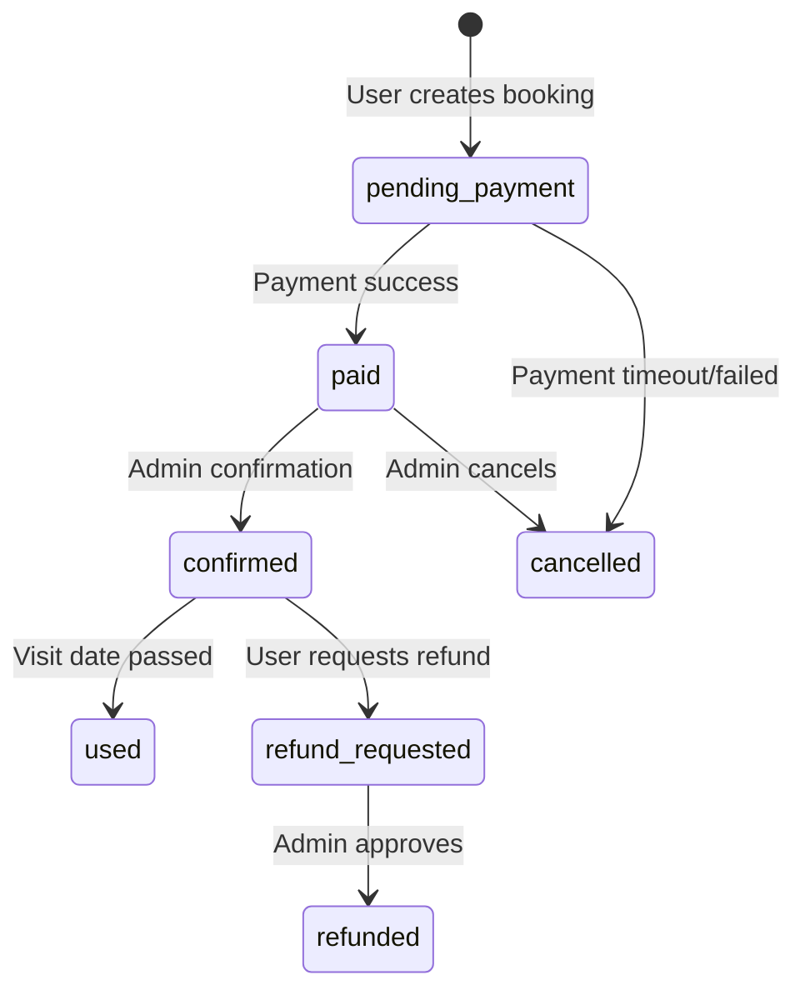

# Enhanced Booking Flow with QR E-Tickets

## 🎯 Overview

Implementasi complete booking flow dengan QR code e-tickets untuk sistem ticketing TravoMate. Alur ini mengikuti best practice e-commerce untuk travel & tourism di Indonesia.

## 📋 User Flow

```
1. User browse destination (DestinationDetailPage)
2. Select date & quantity
3. Click "Beli Tiket"
4. Auth check (redirect to login if not authenticated)
5. Checkout confirmation page (CheckoutPage)
6. Payment via Midtrans Snap
7. Auto-create booking (via database trigger)
8. Generate QR code
9. Send e-ticket via email
10. User can view/download from My Booking
11. Option to request refund (before visit date)
12. Post-visit review prompt
```

## 🛠️ Technical Implementation

### 1. Date Selection in Destination Detail

**File**: `src/pages/DestinationDetailPage.tsx`

**Changes**:
```typescript
// Added visit date state
const [visitDate, setVisitDate] = useState("");

// Date validation
const tomorrow = new Date();
tomorrow.setDate(tomorrow.getDate() + 1);
const minDate = tomorrow.toISOString().split('T')[0];

const maxDate = new Date();
maxDate.setMonth(maxDate.getMonth() + 3);
const maxDateStr = maxDate.toISOString().split('T')[0];

// Auth check before checkout
const handleBuyTicket = () => {
  if (!visitDate) {
    toast.error("Pilih tanggal kunjungan terlebih dahulu");
    return;
  }
  
  if (!isAuthenticated) {
    // Store pending booking in sessionStorage
    sessionStorage.setItem('pendingBooking', JSON.stringify({
      destinationId: id,
      quantity,
      visitDate
    }));
    navigate('/login');
    return;
  }
  
  navigate(`/checkout/${id}?quantity=${quantity}&visitDate=${visitDate}`);
};
```

**UI Components**:
- Date picker dengan calendar icon (Lucide React)
- Min date: Tomorrow (no past dates)
- Max date: 3 months from today
- Quantity selector (1-10 tickets max)
- Dynamic button text based on auth status
- Price summary with visit date

### 2. Checkout Confirmation Page

**File**: `src/pages/CheckoutPage.tsx`

**Changes**:
```typescript
// Read visitDate from URL params
const [searchParams] = useSearchParams();
const visitDate = searchParams.get("visitDate") || "";
const quantity = parseInt(searchParams.get("quantity") || "1", 10);

// Removed date input (already passed from previous page)
// Changed to read-only confirmation page
// Auto-load phone numbers from profile (max 3)
// Display visit date as formatted text (read-only)
```

**Key Features**:
- **Customer Data Section**: Name, email, phone (editable)
- **Phone Selection**: Radio buttons for saved phones (max 3) or custom input
- **Visit Date Display**: Read-only formatted date (Indonesian locale)
- **Order Summary**: Destination image, details, price breakdown with visit date
- **Payment Button**: Midtrans Snap integration
- **Information**: Security badges, e-ticket promise, download info

**Metadata Passed to Payment**:
```typescript
const metadata: PaymentMetadata = {
  userId: user.id,
  bookingType: 'ticket',
  tripDataId: destination.id, // For auto-booking creation
  visitDate: visitDate, // For booking record
};
```

### 3. Payment Service Enhancement

**File**: `src/services/paymentService.ts`

**Changes**:
```typescript
export interface PaymentMetadata {
  tripDataId?: number;
  userId?: string;
  bookingType?: 'trip' | 'ticket' | 'package';
  visitDate?: string; // NEW: ISO date string for visit date
}
```

### 4. Database Schema (Enhanced Booking System)

**File**: `supabase/migrations/enhanced_booking_system.sql`

#### Booking Codes

```sql
-- Generate unique booking codes: TRV-YYYYMMDD-XXXX
CREATE OR REPLACE FUNCTION generate_booking_code()
RETURNS TEXT AS $$
DECLARE
  date_part TEXT;
  random_part TEXT;
  full_code TEXT;
  max_attempts INT := 10;
  attempt INT := 0;
BEGIN
  date_part := TO_CHAR(CURRENT_DATE, 'YYYYMMDD');
  
  LOOP
    random_part := LPAD(FLOOR(RANDOM() * 10000)::TEXT, 4, '0');
    full_code := 'TRV-' || date_part || '-' || random_part;
    
    IF NOT EXISTS (SELECT 1 FROM bookings WHERE booking_code = full_code) THEN
      RETURN full_code;
    END IF;
    
    attempt := attempt + 1;
    IF attempt >= max_attempts THEN
      RAISE EXCEPTION 'Could not generate unique booking code after % attempts', max_attempts;
    END IF;
  END LOOP;
END;
$$ LANGUAGE plpgsql;
```

#### Updated Bookings Table

```sql
ALTER TABLE bookings 
ADD COLUMN IF NOT EXISTS booking_code VARCHAR(50) UNIQUE,
ADD COLUMN IF NOT EXISTS qr_code_url TEXT,
ADD COLUMN IF NOT EXISTS visit_date DATE;

-- Set default booking_code for existing records
UPDATE bookings 
SET booking_code = generate_booking_code() 
WHERE booking_code IS NULL;

-- Update status constraint (7 states)
ALTER TABLE bookings DROP CONSTRAINT IF EXISTS bookings_status_check;
ALTER TABLE bookings ADD CONSTRAINT bookings_status_check 
CHECK (status IN ('pending_payment', 'paid', 'confirmed', 'used', 'cancelled', 'refund_requested', 'refunded'));
```

#### Reviews Table

```sql
CREATE TABLE IF NOT EXISTS reviews (
  id UUID PRIMARY KEY DEFAULT uuid_generate_v4(),
  booking_id UUID NOT NULL REFERENCES bookings(id) ON DELETE CASCADE,
  destination_id INTEGER NOT NULL REFERENCES destinations(id) ON DELETE CASCADE,
  user_id UUID NOT NULL REFERENCES auth.users(id) ON DELETE CASCADE,
  rating INTEGER NOT NULL CHECK (rating >= 1 AND rating <= 5),
  comment TEXT,
  helpful_count INTEGER DEFAULT 0,
  created_at TIMESTAMP WITH TIME ZONE DEFAULT NOW(),
  updated_at TIMESTAMP WITH TIME ZONE DEFAULT NOW(),
  UNIQUE(booking_id, user_id)
);

-- RLS Policies
ALTER TABLE reviews ENABLE ROW LEVEL SECURITY;

CREATE POLICY "Users can view all reviews"
  ON reviews FOR SELECT
  TO authenticated
  USING (true);

CREATE POLICY "Users can create their own reviews"
  ON reviews FOR INSERT
  TO authenticated
  WITH CHECK (auth.uid() = user_id);

CREATE POLICY "Users can update their own reviews"
  ON reviews FOR UPDATE
  TO authenticated
  USING (auth.uid() = user_id)
  WITH CHECK (auth.uid() = user_id);

CREATE POLICY "Users can delete their own reviews"
  ON reviews FOR DELETE
  TO authenticated
  USING (auth.uid() = user_id);
```

#### Auto-Mark Used Bookings

```sql
-- Function to mark past bookings as 'used'
CREATE OR REPLACE FUNCTION mark_past_bookings_as_used()
RETURNS INTEGER AS $$
DECLARE
  updated_count INTEGER;
BEGIN
  UPDATE bookings
  SET status = 'used', updated_at = NOW()
  WHERE status = 'confirmed' 
    AND visit_date < CURRENT_DATE
  RETURNING COUNT(*) INTO updated_count;
  
  RETURN updated_count;
END;
$$ LANGUAGE plpgsql;

-- Schedule: Run daily at 1 AM via pg_cron or external scheduler
-- Example: SELECT cron.schedule('mark-used-bookings', '0 1 * * *', 'SELECT mark_past_bookings_as_used()');
```

### 5. QR Code Service

**File**: `src/services/qrCodeService.ts`

#### API Provider
- **Service**: QR Server API (https://api.qrserver.com)
- **Free tier**: Unlimited requests
- **Format**: PNG image URL
- **Size**: 300x300 pixels

#### Functions

```typescript
/**
 * Generate QR code URL from booking data
 */
export const generateQRCodeURL = (bookingData: BookingQRData): string => {
  const qrContent = JSON.stringify({
    code: bookingData.bookingCode,
    destination: bookingData.destinationName,
    customer: bookingData.customerName,
    date: bookingData.visitDate,
    qty: bookingData.quantity,
    id: bookingData.bookingId,
  });
  
  const encodedData = encodeURIComponent(qrContent);
  return `https://api.qrserver.com/v1/create-qr-code/?size=300x300&data=${encodedData}`;
};

/**
 * Generate and save QR code to booking
 */
export const generateBookingQRCode = async (
  bookingId: string,
  bookingData: BookingQRData
): Promise<string> => {
  const qrUrl = generateQRCodeURL(bookingData);
  
  const { error } = await supabase
    .from('bookings')
    .update({ qr_code_url: qrUrl })
    .eq('id', bookingId);
  
  if (error) throw new Error('Failed to save QR code');
  
  return qrUrl;
};

/**
 * Download QR code as image
 */
export const downloadQRCode = async (
  bookingCode: string,
  qrUrl: string
): Promise<void> => {
  const response = await fetch(qrUrl);
  const blob = await response.blob();
  const url = window.URL.createObjectURL(blob);
  
  const link = document.createElement('a');
  link.href = url;
  link.download = `ticket-${bookingCode}.png`;
  document.body.appendChild(link);
  link.click();
  document.body.removeChild(link);
  window.URL.revokeObjectURL(url);
};

/**
 * Parse QR code data back to object
 */
export const parseQRCodeData = (qrDataString: string): BookingQRData => {
  const parsed = JSON.parse(qrDataString);
  return {
    bookingCode: parsed.code,
    bookingId: parsed.id,
    destinationName: parsed.destination,
    customerName: parsed.customer,
    visitDate: parsed.date,
    quantity: parsed.qty,
  };
};
```

#### QR Code Data Format

```json
{
  "code": "TRV-20250103-1234",
  "destination": "Candi Borobudur",
  "customer": "John Doe",
  "date": "2025-02-15",
  "qty": 2,
  "id": "550e8400-e29b-41d4-a716-446655440000"
}
```

## 🔄 Booking Status Flow



### Status Descriptions

| Status | Description | Actions Available |
|--------|-------------|-------------------|
| `pending_payment` | Awaiting payment | Cancel, Complete payment |
| `paid` | Payment received | View e-ticket, Request refund |
| `confirmed` | Confirmed by admin | View e-ticket, Request refund |
| `used` | Visit date has passed | Submit review, View history |
| `refund_requested` | Refund in process | View status |
| `refunded` | Refund completed | View history |
| `cancelled` | Booking cancelled | View history |

## 📱 Phone Number Management

**Feature**: Auto-load saved phone numbers in checkout

**File**: `src/pages/profile/MyAccount.tsx`

**Rules**:
- Maximum 3 phone numbers per user
- One primary phone number
- Primary phone auto-selected in checkout
- Can add custom phone number if needed

**Database**:
```sql
-- profiles table
phone_numbers TEXT[] DEFAULT '{}',
primary_phone TEXT,

-- Constraint: Max 3 phones
ALTER TABLE profiles ADD CONSTRAINT phone_numbers_limit 
CHECK (array_length(phone_numbers, 1) <= 3);
```

## 📧 Email Notification (Future Implementation)

### E-Ticket Email

**Triggers**:
- After successful payment
- After booking confirmation

**Content**:
- Booking code (large, prominent)
- QR code image (embedded)
- Visit date & time
- Destination details
- Quantity
- Download button
- Refund policy
- Contact info

**Template Variables**:
```javascript
{
  customerName: "John Doe",
  bookingCode: "TRV-20250103-1234",
  destinationName: "Candi Borobudur",
  visitDate: "15 Februari 2025",
  quantity: 2,
  totalPrice: "Rp 100.000",
  qrCodeUrl: "https://api.qrserver.com/...",
  downloadUrl: "https://app.travomate.com/booking/download/..."
}
```

### Review Reminder Email

**Trigger**: 7 days after visit date (for status = 'used')

**Content**:
- Thank you message
- Destination name
- Visit date
- Review form link
- Rating stars (1-5)
- Comment box
- Photo upload (optional)

## 🚀 Deployment Checklist

### Database Migration

```bash
# Run enhanced booking system migration
psql -U postgres -d travomate -f supabase/migrations/enhanced_booking_system.sql

# Verify tables
\dt bookings reviews

# Check booking codes generated
SELECT id, booking_code, status, visit_date FROM bookings LIMIT 10;
```

### Environment Variables

```env
# Midtrans (already configured)
VITE_MIDTRANS_CLIENT_KEY=xxx
MIDTRANS_SERVER_KEY=xxx
VITE_MIDTRANS_ENVIRONMENT=sandbox

# Email Service (to be configured)
SMTP_HOST=smtp.gmail.com
SMTP_PORT=587
SMTP_USER=xxx
SMTP_PASS=xxx
EMAIL_FROM=noreply@travomate.com
```

### Scheduled Jobs

**Option 1: pg_cron (Supabase native)**
```sql
SELECT cron.schedule(
  'mark-used-bookings',
  '0 1 * * *', -- Daily at 1 AM
  'SELECT mark_past_bookings_as_used()'
);

SELECT cron.schedule(
  'send-review-reminders',
  '0 9 * * *', -- Daily at 9 AM
  'SELECT send_review_reminders()'
);
```

**Option 2: External CRON (Vercel Cron Jobs)**
```javascript
// api/cron/mark-used-bookings.ts
export default async function handler(req, res) {
  // Verify cron secret
  if (req.headers['authorization'] !== `Bearer ${process.env.CRON_SECRET}`) {
    return res.status(401).json({ error: 'Unauthorized' });
  }
  
  // Run function
  const { data, error } = await supabase.rpc('mark_past_bookings_as_used');
  
  if (error) return res.status(500).json({ error: error.message });
  
  return res.status(200).json({ 
    success: true, 
    updated: data 
  });
}
```

**Vercel Configuration** (`vercel.json`):
```json
{
  "crons": [
    {
      "path": "/api/cron/mark-used-bookings",
      "schedule": "0 1 * * *"
    },
    {
      "path": "/api/cron/send-review-reminders",
      "schedule": "0 9 * * *"
    }
  ]
}
```

## 🧪 Testing

### Manual Testing Steps

1. **Date Selection Flow**:
   - Navigate to destination detail
   - Try selecting past date (should be blocked)
   - Select valid date (tomorrow to +3 months)
   - Select quantity (1-10)
   - Click "Beli Tiket"

2. **Auth Check**:
   - Not logged in: Should redirect to login with pendingBooking stored
   - After login: Should redirect back to checkout with data preserved

3. **Checkout Confirmation**:
   - Verify visit date displayed correctly (Indonesian format)
   - Check phone selection (radio buttons for saved phones)
   - Verify order summary shows all details
   - Click payment button

4. **Payment Flow**:
   - Midtrans Snap popup opens
   - Select payment method (test with GoPay, Dana, Bank Transfer)
   - Complete payment (use Midtrans sandbox test numbers)
   - Verify redirect to payment finish page

5. **Booking Creation**:
   - Check `bookings` table for new record
   - Verify `booking_code` generated (TRV-YYYYMMDD-XXXX format)
   - Check `status` = 'paid'
   - Verify `visit_date` matches selected date
   - Check `qr_code_url` populated

6. **QR Code**:
   - Open QR code URL in browser (should display QR image)
   - Scan QR with mobile scanner
   - Verify JSON data contains all booking info

### Test Data

**Midtrans Sandbox Cards**:
```
Success: 4811 1111 1111 1114
Challenge: 4911 1111 1111 1113
Denied: 4411 1111 1111 1118
CVV: 123
Exp: 01/25
OTP: 112233
```

**GoPay Test Number**: 
```
Phone: 081234567890
OTP: 111222
```

## 📊 Analytics Events

Track these events for business intelligence:

```javascript
// Date selection
analytics.track('date_selected', {
  destination_id,
  visit_date,
  days_until_visit,
});

// Checkout started
analytics.track('checkout_started', {
  destination_id,
  quantity,
  total_price,
  visit_date,
});

// Payment method selected
analytics.track('payment_method_selected', {
  method: 'gopay' | 'bank_transfer' | 'credit_card',
});

// Booking created
analytics.track('booking_created', {
  booking_code,
  destination_id,
  total_price,
  payment_method,
});

// QR code downloaded
analytics.track('qr_downloaded', {
  booking_code,
});

// Review submitted
analytics.track('review_submitted', {
  booking_code,
  rating,
  has_comment: true/false,
});
```

## 🔐 Security Considerations

1. **QR Code Security**:
   - QR data includes booking ID for verification
   - Validate booking status before allowing entry
   - Check visit date matches current date
   - Prevent duplicate scans (mark as 'used' on first scan)

2. **Refund Policy**:
   - Only allow refunds before visit date
   - Configurable refund window (e.g., 24 hours before)
   - Admin approval required
   - Deduct processing fee if applicable

3. **Email Verification**:
   - Ensure email is verified before sending e-tickets
   - Implement email bouncing handling
   - Rate limit email sending

4. **Phone Number**:
   - Validate Indonesian phone format (+62)
   - Limit phone number changes per day
   - Send OTP for phone verification (optional)

## 🎨 UI/UX Enhancements

### Desktop Checkout
- Sticky order summary on right column
- Progress indicator (1. Date → 2. Details → 3. Payment)
- Breadcrumbs navigation
- Clear CTA buttons

### Mobile Optimization
- Single column layout
- Fixed bottom button bar
- Collapsible order summary
- Date picker native input (better UX)

### Success State
- Confetti animation
- Booking code prominent display
- QR code preview
- Download button
- Share to WhatsApp/Email
- Add to calendar button

## 📝 Next Steps

### Priority 1 (Essential)
- [ ] Integrate QR generation in webhook handler
- [ ] Create BookingDetailPage with QR display
- [ ] Implement refund request modal
- [ ] Email notification service
- [ ] Booking list page (My Bookings)

### Priority 2 (Important)
- [ ] Review submission form
- [ ] Review display on destination detail
- [ ] Scheduled job for marking used bookings
- [ ] Review reminder notifications
- [ ] Admin dashboard for booking management

### Priority 3 (Nice to Have)
- [ ] QR scanner app (for venue staff)
- [ ] Push notifications
- [ ] WhatsApp integration
- [ ] PDF ticket generation
- [ ] Print ticket option
- [ ] Booking modification flow
- [ ] Gift/transfer booking

## 🐛 Known Issues & Limitations

1. **QR API Dependency**: Free tier QR Server API may have rate limits
   - **Solution**: Consider self-hosting QR generator or paid plan

2. **Email Deliverability**: Emails might go to spam
   - **Solution**: Implement SPF, DKIM, DMARC records

3. **Timezone**: All dates assumed UTC+7 (WIB)
   - **Solution**: Store timezone info in bookings table

4. **Payment Timeout**: Pending payments expire after 24h
   - **Solution**: Add reminder email before expiration

## 📚 References

- [Midtrans Documentation](https://docs.midtrans.com)
- [QR Server API](https://goqr.me/api/)
- [Supabase RLS Policies](https://supabase.com/docs/guides/auth/row-level-security)
- [React Router v6](https://reactrouter.com/en/main)
- [Shadcn UI Components](https://ui.shadcn.com)

---

**Last Updated**: January 3, 2025  
**Version**: 1.0  
**Author**: TravoMate Development Team
